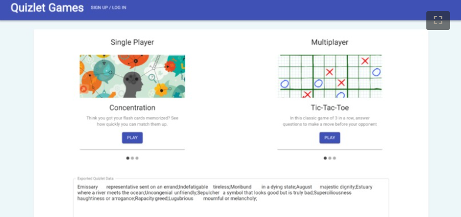

<h1 align="center">Quizlet Games</h1>

  

    Studying flashcards is super important -- but its usually not fun and can be very repetitive. :( Although apps like Quizlet have tried to optimize this experience through creating an interactive learning platform, we felt that the existing structure was not enough to compel users to voluntarily want to study their flashcards. With this in mind, we conceptualized a platform of our own that would incorporate Quizlet flashcards within a series of fun, interactive games! 

## Concentration

See how well you have your cards memorized by playing the classic memory matching game. Flip a card and try to find the matching definition/term. If you get it wrong, try to remember the cards you have already flipped.

## Tic-Tac-Toe

Play with a friend and get competitive! Once you answer a question, place an X or O on the board. The quicker you answer, the faster you play. See who has a better grasp on your Quizlet material.

## Connect 4

Play by yourself or with a friend. Answer a question before you are able to play, and try to connect 4 pieces in a row. Make sure to watch out for your opponent's connections!
